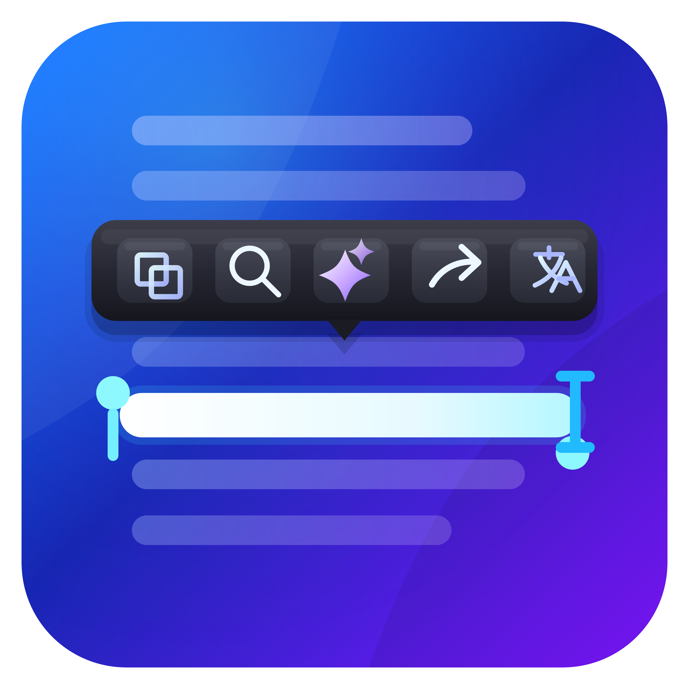

# TextPik

Popup action bar on text selection for Linux desktops (Wayland & X11).

Development status: **0.4.0 RC1 candidate**. Promotion requirements are tracked
in the [release checklist](docs/release-checklist.md). Security-sensitive reports
must follow [SECURITY.md](SECURITY.md) instead of a public bug report.

Select text anywhere and a customizable action bar appears at your cursor —
copy, search, translate, open links, and more with one click.
<p align="center">
  
</p>

## Features

- 22 built-in actions: copy/paste, search, translation, text transforms,
  terminal, print, Ollama, KDE Connect and Klipper
- Context-aware filtering for URLs, email, code, numbers and regular text,
  while preserving the user's fixed order
- Compact popup plus fuzzy-searchable “More actions” palette with pinning and
  one-click per-application exclusion
- Smart placement beside the pointer without covering the selected text,
  right-click suppression and optional inactivity auto-hide
- Configurable icon size, bar padding, spacing, visible-action count and cursor gap
- File-manager awareness: file objects are ignored while text fields still work
- Native desktop identity, XDG autostart management, AppStream metadata and
  system-tray active/paused status
- Capability-aware actions with clear status for CUPS, Ollama, terminals,
  KDE Connect, Klipper and automatic paste fallbacks
- Native URL/file opening through Qt desktop services and sandbox portals
- KDE Plasma integration: Klipper D-Bus, KWin cursor bridge, system tray
- Event-driven AT-SPI selection detection with a low-frequency compatibility
  fallback for applications that do not emit accessibility notifications
- Revisioned selection sessions discard stale Wayland/AT-SPI results, while the
  intent engine suppresses menus, file objects and TextPik's own interface
- Wayland positioning via AT-SPI selection geometry, KWin, Hyprland and Sway;
  slow compositor/process probes run outside the popup display path and position
  hysteresis prevents small cursor changes from making the bar jitter
- Text transformations replace editable selections through AT-SPI, with a safe
  clipboard fallback
- Click-outside-to-close
- Configurable settings with theme presets (Light, Dark, OLED)
- Numeric shortcuts 1-9 and arrow/Enter keyboard navigation when invoked by hotkey
- Per-application, activity and game exclusions

## Requirements

- KDE Plasma, GNOME, Hyprland, Sway or another modern Linux desktop
- Python 3.10+
- [PySide6](https://pypi.org/project/PySide6/)
- `wl-clipboard` plus `wtype` or `ydotool` on Wayland
- `xdotool` on X11

## Installation

```bash
git clone https://github.com/pitydah/textpik.git
cd textpik
chmod +x packaging/install.sh
./packaging/install.sh
```

This installs system packages, creates the `textpik` command, a `.desktop`
entry, autostart, and the KWin cursor bridge script.

After installation, launch from the app menu or run:

```bash
textpik
```

## Quick run (no install)

```bash
git clone https://github.com/pitydah/textpik.git
cd textpik
python3 src/textpik.py
```

## Wayland vs X11

| Feature | Wayland | X11 |
|---------|---------|-----|
| Popup anchor | AT-SPI, then KWin/Hyprland/Sway/pointer | AT-SPI or xdotool |
| Click-outside | focus events + KWin | X11 pointer polling |
| Clipboard | wl-clipboard | xclip / xsel |
| Window opacity | Not supported | Fade-in animation |

On KDE Wayland, activate the optional KWin bridge after installation:

**System Settings → Window Management → KWin Scripts → check "TextPik Cursor Bridge" → Apply**

On other Wayland desktops, TextPik first asks AT-SPI for the selected text
geometry. If the application does not expose accessibility information it uses
the compositor adapter, and finally a safe screen-relative fallback. Enable the
desktop accessibility bus for the most accurate result on GNOME and other
non-KDE environments.

## Compatibility

Distribution support:

| Distro | Status |
|--------|--------|
| Arch / CachyOS / Manjaro | Primary target |
| Fedora KDE Spin | Supported |
| KDE neon / Kubuntu 24.04+ | Supported |
| Debian 13 KDE | Supported |
| openSUSE Tumbleweed KDE | Supported |
| Debian 13 / Ubuntu 24.04+ | Supported through modular PySide6 packages |
| Fedora / CentOS Stream | Supported; EPEL or pip may be needed on CentOS |
| Alpine Linux | Supported through `apk` |
| Void Linux | Supported through `xbps-install` |
| Slackware | Community support; SlackBuilds required for desktop tools |

Desktop support:

| Desktop | X11 | Wayland |
|---------|-----|---------|
| KDE Plasma | Full | Full with optional KWin cursor bridge |
| GNOME | Full | Supported with safe popup-position fallback |
| Cinnamon / MATE / XFCE | Full | Supported where the desktop offers Wayland |
| Sway / Hyprland / other wlroots | N/A | Supported with `wl-clipboard` and `wtype` |

Klipper actions are shown only in KDE. KDE Connect remains available on other
desktops when its D-Bus service or `kdeconnect-cli` is installed. Selection
monitoring uses X11 PRIMARY or the standard Wayland `wl-clipboard` protocol.

## Packaging

- `packaging/install.sh`: portable per-user installation for Arch, Debian,
  Ubuntu, Fedora, CentOS, openSUSE, Alpine, Void and Slackware. Files are copied to
  `~/.local/share/textpik`, so the original checkout can be moved or deleted.
- `packaging/arch/PKGBUILD`: native Arch package with optional integrations.
- `packaging/debian`: Debian/Ubuntu source package metadata.
- `packaging/rpm/textpik.spec`: Fedora/RHEL-family RPM recipe.
- `packaging/io.github.pitydah.textpik.metainfo.xml`: AppStream metadata used
  by software centers and native packages.
- `packaging/flatpak/io.github.pitydah.textpik.json`: KDE/PySide Flatpak
  manifest with `wl-clipboard` bundled for primary-selection monitoring.
- `packaging/appimage/build.sh`: self-contained AppImage build using
  PyInstaller.

The source resolves assets from development checkouts, user installations,
system packages, Flatpak and PyInstaller/AppImage layouts.

## CLI mode

```bash
textpik run "Buscar en Google" "search query"
textpik run "Buscar en DuckDuckGo" "text to search"
```

## Configuration

Settings: `~/.config/textpik/settings.json`
Actions:  `~/.config/textpik/actions.json`
Local extensions: `~/.local/share/textpik/extensions/<id>/manifest.json`

The local extension format and permission model are documented in
[`docs/extensions.md`](docs/extensions.md).
Logs:     `~/.cache/textpik/textpik.log`

## License

GNU General Public License v3.0. See [LICENSE](LICENSE).
